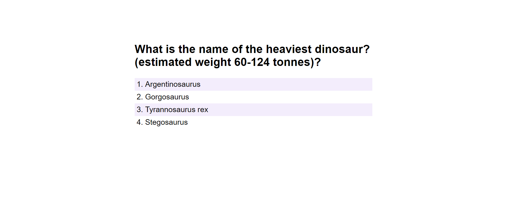
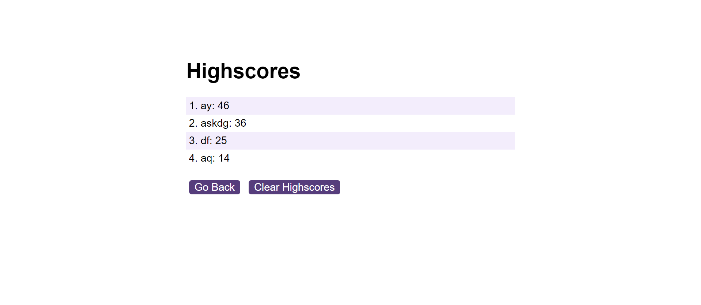

# API-Quiz-Game

# Dinosaur Quiz Game

Welcome to the Dinosaur Quiz Game! This interactive web application quizzes users on their knowledge of dinosaurs. The game features a series of questions with multiple-choice answers. Users are timed, and incorrect answers result in a time penalty.

## Getting Started

To play the game, open the `index.html` file in a web browser. Click the "Start Quiz" button to begin. Answer each question by selecting one of the provided choices. Your final score is displayed at the end of the quiz.

## Features

- Multiple-choice questions about dinosaurs.
- Timer with time penalties for incorrect answers.
- High score tracking with user initials.

## How to Play

1. Click the "Start Quiz" button.
2. Answer each question by selecting a choice.
3. Get feedback on whether your answer is correct or wrong.
4. Complete the quiz to see your final score.
5. Enter your initials and submit to record your high score.

## Used:

- HTML
- CSS
- JavaScript

## Credits

- Questions sourced from various dinosaur trivia websites.

